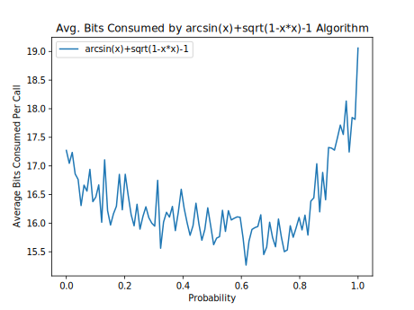
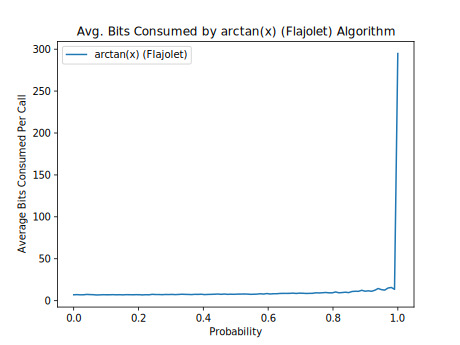
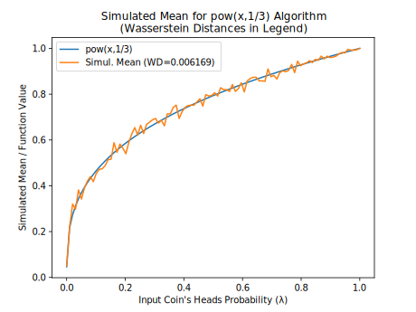
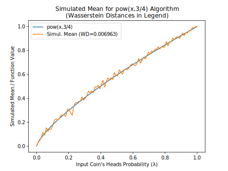
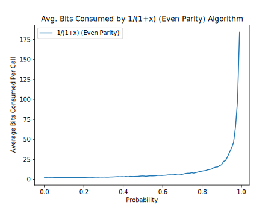
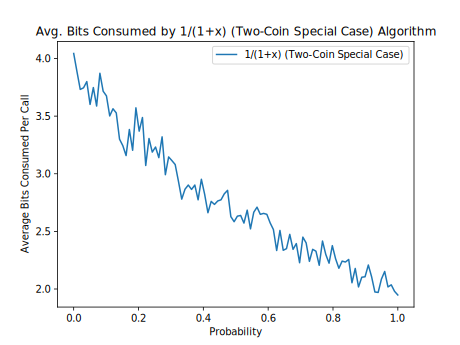
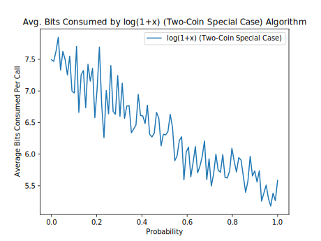
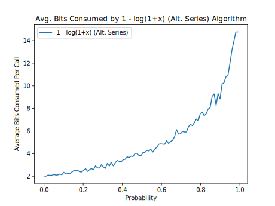

# Bernoulli Factory Algorithms

[**Peter Occil**](mailto:poccil14@gmail.com)

## Introduction

This page catalogs algorithms to turn coins biased one way into coins biased another way, also known as _Bernoulli factories_.  Many of them were suggested in (Flajolet et al., 2010)[**(1)**](#Note1), but without step-by-step instructions in many cases.  This page provides these instructions to help programmers implement the Bernoulli factories they describe.

### About This Document

**This is an open-source document; for an updated version, see the** [**source code**](https://github.com/peteroupc/peteroupc.github.io/raw/master/bernoulli.md) **or its** [**rendering on GitHub**](https://github.com/peteroupc/peteroupc.github.io/blob/master/bernoulli.md)**.  You can send comments on this document on the** [**GitHub issues page**](https://github.com/peteroupc/peteroupc.github.io/issues)**.  You are welcome to suggest additional Bernoulli factory algorithms.**

## About Bernoulli Factories

A _Bernoulli factory_ (Keane and O'Brien 1994)[**(2)**](#Note2) is an algorithm that takes an input coin (a method that returns 1, or heads, with an unknown probability, or 0, or tails, otherwise) and returns 0 or 1 with a probability that depends on the input coin's probability of heads.  For example, a Bernoulli factory algorithm can take a coin that returns heads with probability &lambda; and produce a coin that returns heads with probability exp(&minus;&lambda;).

A _factory function_ is a function that relates the old probability to the new one.  Its domain is [0, 1] and returns a probability in [0, 1].  There are certain requirements for factory functions.  As shown by Keane and O'Brien (1994)[**(2)**](#Note2), a function _f_ can serve as a factory function if and only if _f_, in the interval \[0, 1\]&mdash;

- is continuous everywhere, and
- either returns a constant value in \[0, 1\] everywhere, or returns a value in \[0, 1\] at each of the points 0 and 1 and a value in (0, 1) at each other point.

As one example, the function _f_ = 2*p cannot serve as a factory function, since its graph touches 1 somewhere in the open interval (0, 1).

The next section will show algorithms for a number of factory functions, allowing different kinds of probabilities to be simulated from input coins.

## Algorithms

In the following algorithms:

- &lambda; is the unknown probability of heads of the input coin.
- The **SampleGeometricBag** and **URandLess** algorithms are described in my article on [**partially-sampled random numbers (PSRNs)**](https://peteroupc.github.io/exporand.html).
- The `ZeroOrOne` method should be implemented as shown in my article on [**random sampling methods**](https://peteroupc.github.io/randomfunc.html#Boolean_True_False_Conditions).
- The instruction to "generate a uniform random number" can be implemented by creating an empty [**uniform PSRN**](https://peteroupc.github.io/exporand.html) (most accurate) or by generating `RNDEXCRANGE(0, 1)` or `RNDINT(1000)` (less accurate).
- Where an algorithm says "if _a_ is less than _b_", where _a_ and _b_ are uniform random numbers, it means to run the **URandLess** algorithm on the two PSRNs, or do a less-than operation on _a_ and _b_, as appropriate.
- For best results, the algorithms should be implemented using exact rational arithmetic (such as `Fraction` in Python or `Rational` in Ruby).

The algorithms as described here do not always lead to the best performance.  An implementation may change these algorithms as long as they produce the same results as the algorithms as described here.  Some algorithms are described as "uniformly fast".  This means that their average running time is bounded from above for all choices of &lambda; and other parameters (Devroye 1986, esp. p. 717)[**(3)**](#Note3).

**Algorithms for exp(&minus;&lambda;).**

The algorithm in (Flajolet et al., 2010)[**(1)**](#Note1) calls for generating a Poisson(&lambda;) random number and returning 1 if that number is 0, or 0 otherwise.  The Poisson generator in turn involves generating a geometric(&lambda;) random number _G_[**(4)**](#Note4), then _G_ uniform random numbers, then returning _G_ only if all _G_ uniform numbers are sorted.[**(5)**](#Note5)  The algorithm follows.

1. Flip the input coin until the coin returns 0.  Then set _G_ to the number of times the coin returns 1 this way.
2. If _G_ is 0, return 1.
3. Generate a uniform random number _w_, and set _i_ to 1.
4. While _i_ is less than _G_:
    1. Generate a uniform random number _U_.
    2. If _w_ is less than _U_, break out of this loop and go to step 1.
    3. Add 1 to _i_, and set _w_ to _U_.
5. Return 0.  (_G_ is now a Poisson(&lambda;) random number, but is other than 0.)

This algorithm, however, runs very slowly as &lambda; approaches 1.

Here is an alternative version of the algorithm above, which doesn't generate a geometric random number at the outset.

1. Set _k_ and _w_ each to 0.
2. Flip the input coin.  If the coin returns 0 and _k_ is 0, return 1.  Otherwise, if the coin returns 0, return 0.
3. Generate a uniform random number _U_.
4. If _k_ > 0 and _w_ is less than _U_, go to step 1.
5. Set _w_ to _U_, add 1 to _k_, and go to step 2.

In turn, this algorithm likewise converges very slowly as &lambda; approaches 1.

A third algorithm is uniformly fast everywhere in (0, 1).   It uses the reverse-time martingale approach for alternating series in (Łatuszyński et al. 2009/2011)[**(6)**](#Note6) and makes use of the fact that exp(&minus;&lambda;) can be rewritten as 1 &minus; &lambda; + &lambda;2/2 &minus; &lambda;3/6 + &lambda;4/24 &minus; ..., which is an alternating series whose coefficients are 1, 1, 1/(2!), 1/(3!), 1/(4!), ..., which satisfy the requirements for this approach because the coefficients are nonincreasing and all 1 or less.  However, the algorithm requires a bit more arithmetic, notably rational division.

First, the general algorithm for the reverse-time martingale approach (called the **general martingale algorithm**) follows.  It takes a list of coefficients and an input coin, and returns 1 with probability _c[0]_ &minus; _c[1]_ * &lambda; + _c[2]_ * &lambda;2 &minus; ..., and 0 otherwise.

1. Let _c[0]_, _c[1]_, etc. be the first, second, etc. coefficients of the alternating series.  Set _u_ to _c[0]_, set _w_ to 1, set _l_ to 0, and set _n_ to 1.
2. Create an empty uniform PSRN.
3. If _w_ is not 0, flip the input coin and multiply _w_ by the result of the flip.
4. If _n_ is even, set _u_ to _l_ + _w_ * _c[n]_.  Otherwise, set _l_ to _u_ + _w_ * _c[n]_.
5. Run the **URandLessThanFraction algorithm** on the PSRN and _l_.  If the algorithm returns 1, return 1.
6. Run the **URandLessThanFraction algorithm** on the PSRN and _u_.  If the algorithm returns 0, return 0.
7. Add 1 to _n_ and go to step 3.

For **exp(&minus;&lambda;)**, modify that algorithm as follows for more efficiency:

- Rather than multiplying by _c[n]_ in step 4, divide _w_ by _n_ in step 3 (after multiplying by the result of the flip).  This is a more efficient way to take account of the factorial in the second and later coefficients.

**Algorithm for exp(&lambda;)*(1&minus;&lambda;)**  (Flajolet et al., 2010)[**(1)**](#Note1):

1. Set _k_ and _w_ each to 0.
2. Flip the input coin.  If it returns 0, return 1.
3. Generate a uniform random number _U_.
4. If _k_ > 0 and _w_ is less than _U_, return 0.
5. Set _w_ to _U_, add 1 to _k_, and go to step 2.

**Algorithms for 1/(1+&lambda;).**

One algorithm is the general martingale algorithm, since when &lambda; is in [0, 1], this function is an alternating series of the form `1 - x + x^2 - x^3 + ...`, whose coefficients are 1, 1, 1, 1, ....  However, this algorithm converges slowly when &lambda; is very close to 1.

A second algorithm is the so-called "even-parity" construction of (Flajolet et al., 2010)[**(1)**](#Note1).  However, this algorithm too converges slowly when &lambda; is very close to 1.

1. Flip the input coin.  If it returns 0, return 1.
2. Flip the input coin.  If it returns 0, return 0.  Otherwise, go to step 1.

A third algorithm is a special case of the two-coin Bernoulli factory of (Gonçalves et al., 2017)[**(7)**](#Note7) and is uniformly fast, unlike the previous two algorithms:

1. With probability 1/2, return 1. (For example, generate an unbiased random bit and return 1 if that bit is 1.)
2. Flip the input coin.  If it returns 1, return 0.  Otherwise, go to step 1.

**Algorithm for log(1+&lambda;)**  (Flajolet et al., 2010)[**(1)**](#Note1):

1. Create an empty uniform PSRN.
2. Flip the input coin.  If it returns 0, flip the coin again and return the result.
3. Call the **SampleGeometricBag** algorithm with the PSRN.  If it returns 0, flip the input coin and return the result.
4. Flip the input coin.  If it returns 0, return 0.
5. Call the **SampleGeometricBag** algorithm with the PSRN.  If it returns 0, return 0.  Otherwise, go to step 2.

Observing that the even-parity construction used in the Flajolet paper is equivalent to the two-coin special case, which is uniformly fast for all &lambda; parameters, the algorithm above can be made uniformly fast as follows:

1. Create an empty uniform PSRN.
2. With probability 1/2, flip the input coin and return the result.
3. Call **SampleGeometricBag** on the PSRN, then flip the input coin.  If the call and the flip both return 1, return 0.  Otherwise, go to step 2.

A third algorithm is to invert the result of the algorithm for 1 &minus; log(1+&lambda;) below (make it 1 if it's 0 and vice versa).

**Algorithm for 1 &minus; log(1+&lambda;).**  This algorithm uses the reverse-time martingale approach in (Łatuszyński et al. 2009/2011)[**(6)**](#Note6).  Here, the alternating series is `1 - x + x^2/2 - x^3/3 + ...`, whose coefficients are 1, 1, 1/2, 1/3, ....  Follow the general martingale algorithm, but note that this algorithm uses more bits on average as &lambda; approaches 1.

Alternatively, invert the result of either of the algorithms for log(1+&lambda;) (make it 1 if it's 0 and vice versa).

**Algorithm for _c_ * &lambda; * &beta; / (&beta; * (_c_ * &lambda; + _d_ * &mu;) &minus; (&beta; &minus; 1) * (_c_ + _d_)).**  This is the general two-coin algorithm of (Gonçalves et al., 2017)[**(7)**](#Note7) and (Vats et al. 2020)[**(8)**](#Note8).  It takes two input coins that each output heads (1) with probability &lambda; or &mu;, respectively.  It also takes a parameter &beta; in the interval [0, 1], which is a so-called "portkey" or early rejection parameter (when &beta; = 1, the formula simplifies to _c_ * &lambda; / (_c_ * &lambda; + _d_ * &mu;)).

1. With probability &beta;, go to step 2.  Otherwise, return 0. (For example, call `ZeroOrOne` with &beta;'s numerator and denominator, and return 0 if that call returns 0, or go to step 2 otherwise.)
2. With probability _c_ / (_c_ + _d_), flip the &lambda; input coin.  Otherwise, flip the &mu; input coin.  If the &lambda; input coin returns 1, return 1.  If the &mu; input coin returns 1, return 0.  If the corresponding coin returns 0, go to step 1.

**Algorithm for _c_ * &lambda; / (_c_ * &lambda; + _d_) or (_c_/_d_) * &lambda; / (1 + (_c_/_d_) * &lambda;)).** This algorithm, also known as the **logistic Bernoulli factory** (Huber 2016)[**(9)**](#Note9), (Morina et al., 2019)[**(10)**](#Note10), is a special case of the two-coin algorithm above, but this time uses only one input coin.

1. With probability _d_ / (_c_ + _d_), return 0.
2. Flip the input coin.  If the coin returns 1, return 1.  Otherwise, go to step 1.

(Note that Huber specifies this Bernoulli factory in terms of a Poisson point process, which seems to require much more randomness on average.)

**Algorithm for arctan(&lambda;) /&lambda;** (Flajolet et al., 2010)[**(1)**](#Note1):

1. Generate an empty uniform PSRN.
2. Call **SampleGeometricBag** twice on the PSRN, and flip the input coin twice.  If any of these calls or flips returns 0, return 1.
3. Call **SampleGeometricBag** twice on the PSRN, and flip the input coin twice.  If any of these calls or flips returns 0, return 0.  Otherwise, go to step 2.

Observing that the even-parity construction used in the Flajolet paper is equivalent to the two-coin special case, which is uniformly fast for all &lambda; parameters, the algorithm above can be made uniformly fast as follows:

1. Create an empty uniform PSRN.
2. With probability 1/2, return 1.
3. Call **SampleGeometricBag** twice on the PSRN, and flip the input coin twice.  If all of these calls and flips return 1, return 0.  Otherwise, go to step 2.

**Algorithm for arctan(&lambda;)** (Flajolet et al., 2010)[**(1)**](#Note1):

- Call the **algorithm for arctan(&lambda;) /&lambda;** and flip the input coin.  Return 1 if the call and flip both return 1, or 0 otherwise.

**Algorithm for &lambda;_x_/_y_.** In the algorithm below, the case where _x_/_y_ is in (0, 1) is due to recent work by Mendo (2019)[**(11)**](#Note11).  The algorithm works only when _x_/_y_ is 0 or greater.

1. If _x_/_y_ is 0, return 1.
2. If _x_/_y_ is equal to 1, flip the input coin and return the result.
3. If _x_/_y_ is greater than 1, flip the input coin `floor(_x_/_y_)` times and call this algorithm (once and recursively) with _x_/_y_ =_x_/_y_ &minus; floor(_x_/_y_).  Return 1 if all these calls and flips return 1; otherwise, return 0.
4. _x_/_y_ is less than 1, so set _i_ to 1.
5. Flip the input coin; if it returns 1, return 1.
6. Return 0 with probability _x_/(_y_*_i_).
7. Add 1 to _i_ and go to step 5.

Note, however, that when _x_/_y_ < 1, this algorithm converges more and more slowly as &lambda; approaches 0.

**Algorithm for sqrt(&lambda;).** Use the algorithm for &lambda;1/2.

**Algorithm for arcsin(&lambda;) + sqrt(1 &minus; &lambda;2) &minus; 1.** (Flajolet et al., 2010)[**(1)**](#Note1).  The algorithm given here uses the special two-coin case rather than the even-parity construction.

1. Create an empty uniform PSRN.
2. Create a secondary coin &mu; that does the following:
    - Call **SampleGeometricBag** twice on the PSRN, and flip the input coin twice.  If all of these calls and flips return 1, return 0.  Otherwise, return 1.
3. Call the **algorithm for &mu;1/2** using the secondary coin &mu;.  If it returns 0, return 0.
4. With probability 1/2, flip the input coin and return the result.
5. Call **SampleGeometricBag** once on the PSRN, and flip the input coin once.  If both the call and flip return 1, return 0.  Otherwise, go to step 4.

**Algorithm for arcsin(&lambda;) / 2.**  The Flajolet paper doesn't explain in detail how arcsin(&lambda;)/2 arises out of arcsin(&lambda;) + sqrt(1 &minus; &lambda;2) &minus; 1 via Bernoulli factory constructions, but here is an algorithm.[**(12)**](#Note12)

1. With probability 1/2, run the **algorithm for arcsin(&lambda;) + sqrt(1 &minus; &lambda;2) &minus; 1** and return the result.
2. Create a secondary coin &mu; that does the following:
    - Flip the input coin twice.  If both flips return 1, return 0.  Otherwise, return 1.
3. Call the **algorithm for &mu;1/2** using the secondary coin &mu;.  If it returns 0, return 1; otherwise, return 0.

### Algorithms for Irrational Constants

The following algorithms generate heads with a probability equal to an irrational number.  (On the other hand, probabilities that are _rational_ constants are trivial to simulate.  If fair coins are available, the `ZeroOrOne` method should be used.  If coins with unknown bias are available, then a _randomness extraction_ method such as the von Neumann algorithm should be used to turn them into fair coins.  Randomness extraction is outside the scope of this document, however.)

**Algorithm for arctan(_x_/_y_) \* _y_/_x_** (Flajolet et al., 2010)[**(1)**](#Note1):

1. Create an empty uniform PSRN.
2. Generate a number that is 1 with probability _x_ * _x_/(_y_ * _y_), or 0 otherwise.  If the number is 0, return 1.
3. Call **SampleGeometricBag** twice on the PSRN.  If either of these calls returns 0, return 1.
4. Generate a number that is 1 with probability _x_ * _x_/(_y_ * _y_), or 0 otherwise.  If the number is 0, return 0.
5. Call **SampleGeometricBag** twice on the PSRN.  If either of these calls returns 0, return 0.  Otherwise, go to step 2.

Observing that the even-parity construction used in the Flajolet paper is equivalent to the two-coin special case, which is uniformly fast, the algorithm above can be made uniformly fast as follows:

1. Create an empty uniform PSRN.
2. With probability 1/2, return 1.
3. With probability _x_ * _x_/(_y_ * _y_), call **SampleGeometricBag** twice on the PSRN.  If both of these calls return 1, return 0.
4. Go to step 2.

**Algorithm for &pi; / 4** (Flajolet et al., 2010)[**(1)**](#Note1):

1. Generate a random integer in the interval [0, 6), call it _n_.
2. If _n_ is less than 3, return the result of the **algorithm for arctan(1/2) \* 2**.  Otherwise, if _n_ is 3, return 0.  Otherwise, return the result of the **algorithm for arctan(1/3) \* 3**.

### General Algorithms

**Algorithm for the probability generating function.**  Let _X_ be a random number that follows a discrete distribution (one that takes on a countable number of values).  The following algorithm generates heads with probability **E**\[&lambda;_X_\], that is, the expected (average) value of &lambda;_X_.  **E**\[&lambda;_X_\] is the distribution's _probability generating function_, also known as _factorial moment generating function_ (Dughmi et al. 2017)[**(13)**](#Note13).

1. Generate a random number _N_ of the given distribution.
2. Flip the input coin until the coin returns 0 or the coin is flipped _N_ times.  Return 1 if all the coin flips, including the last, returned 1 (or if _N_ is 0); or return 0 otherwise.

**URandLessThanFraction algorithm**.  The following helper algorithm is used by some of the algorithms on this page.  It returns 1 if a PSRN turns out to be less than a fraction, _frac_, which is a number in the interval \[0, 1\].

1. If _frac_ is 0 or 1, return 0 or 1, respectively. (The case of 1 is a degenerate case since the PSRN could, at least in theory, represent an infinite sequence of ones, making it equal to 1.)
2. Set _pt_ to 1/_base_, and set _i_ to 0. (_base_ is the base, or radix, of the PSRN's digits, such as 2 for binary or 10 for decimal.)
3. Set _d1_ to the digit at the _i_th position (starting from 0) of the uniform PSRN.  If there is no digit there, put a digit chosen uniformly at random at that position and set _d1_ to that digit.
4. Set _d2_ to floor(_frac_ / _pt_).  (For example, in base 2, set _d2_ to 0 if _frac_ is less than _pt_, or 1 otherwise.)
5. If _d1_ is less than _d2_, return 1.  If _d1_ is greater than _d2_, return 0.
6. If _frac_ >= _pt_, subtract _pt_ from _frac_.
7. Divide _pt_ by _base_, add 1 to _i_, and go to step 3.

## Correctness and Performance Charts

The following charts show the correctness of many of the algorithms on this page and show their performance in terms of the number of bits they use on average.  For each algorithm, and for each of 100 &lambda; values evenly spaced from 0.0001 to 0.9999:

- 500 runs of the algorithm were done.  Then...
- The number of bits used by the runs were averaged, as were the return values of the runs (since the return value is either 0 or 1, the mean return value will be in the interval [0, 1]).

For each algorithm, if a single run was detected to use more than 5000 bits for a given &lambda;, the entire data point for that &lambda; was suppressed in the charts below.

### The Charts

| Algorithm | Simulated Mean | Average Bits Consumed |
 --- | --- | --- |
| arcsin(x)+sqrt(1-x\*x)-1 |  |  |
| arcsin(x)/2 |  |  |
| arctan(x) (Two-Coin Special Case) |  |  |
| arctan(x) (Flajolet) |  |  |
| exp(-x) (Alt. Series) |  |  |
| sqrt(x) |  |  |
| pow(x,1/3) |  |  |
| pow(x,3/4) |  |  |
| pow(x,4/5) |  |  |
| pow(x,5/4) |  |  |
| pow(x,2/1) |  |  |
| pow(x,5/1) |  |  |
| exp(-x) (Flajolet) |  |  |
| exp(-x) (Alg. 2) |  |  |
| 1/(1+x) (Alt. Series) |  |  |
| 1/(1+x) (Even Parity) |  |  |
| 1/(1+x) (Two-Coin Special Case) |  |  |
| log(1+x) (Flajolet) |  |  |
| log(1+x) (Two-Coin Special Case) |  |  |
| 1 - log(1+x) (Alt. Series) |  |  |
| 0.5\*x/(1+0.5\*x) |  |  |
| (1/3)\*x/(1+(1/3)\*x) |  |  |
| exp(x)\*(1-x) |  |  |

## Notes

<small>(1) Flajolet, P., Pelletier, M., Soria, M., "[**On Buffon machines and numbers**](https://arxiv.org/abs/0906.5560v2)", arXiv:0906.5560v2  [math.PR], 2010.</small>

<small>(2) Keane,  M.  S.,  and  O'Brien,  G.  L., "A Bernoulli factory", _ACM Transactions on Modeling and Computer Simulation_ 4(2), 1994.</small>

<small>(3) Devroye, L., [**_Non-Uniform Random Variate Generation_**](http://luc.devroye.org/rnbookindex.html), 1986.</small>

<small>(4) As used here and in the Flajolet paper, a geometric random number is the number of successes before the first failure, where the success probability is &lambda;.</small>

<small>(5) The Flajolet paper describes what it calls the _von Neumann schema_, which, given a permutation specification and an input coin, generates a random non-negative integer _n_ with probability equal to (&lambda;_n_ * V(_n_) / _n_!) / &Sigma;_k_ = 0, 1, ... (&lambda;_k_ * V(_k_) / _k_!), where V(_n_) is the number of _valid_ permutations of size _n_.  Here, the sum in this formula is also known as an _exponential generating function_.  Effectively, a geometric(&lambda;) random number _G_ is accepted with probability V(_G_)/_G_! (where _G_! is the number of _possible_ permutations of size _G_, or 1 if _G_ is 0), and rejected otherwise.</small>

<small>(6) Łatuszyński, K., Kosmidis, I.,  Papaspiliopoulos, O., Roberts, G.O., "[**Simulating events of unknown probabilities via reverse time martingales**](https://arxiv.org/abs/0907.4018v2)", arXiv:0907.4018v2 [stat.CO], 2009/2011.</small>

<small>(7) Gonçalves, F. B., Łatuszyński, K. G., Roberts, G. O. (2017).  Exact Monte Carlo likelihood-based inference for jump-diffusion processes.</small>

<small>(8) Vats, D., Gonçalves, F. B., Łatuszyński, K. G., Roberts, G. O. Efficient Bernoulli factory MCMC for intractable likelihoods, arXiv:2004.07471v1 [stat.CO], 2020.</small>

<small>(9) Huber, M., "[**Optimal linear Bernoulli factories for small mean problems**](https://arxiv.org/abs/1507.00843v2)", arXiv:1507.00843v2 [math.PR], 2016</small>

<small>(10) Morina, G., Łatuszyński, K., et al., "[**From the Bernoulli Factory to a Dice Enterprise via Perfect Sampling of Markov Chains**](https://arxiv.org/abs/1912.09229v1)", arXiv:1912.09229v1 [math.PR], 2019.</small>

<small>(11) Mendo, Luis. "An asymptotically optimal Bernoulli factory for certain functions that can be expressed as power series." Stochastic Processes and their Applications 129, no. 11 (2019): 4366-4384.</small>

<small>(12) One of the only implementations I could find of this, if not the only, was a [**Haskell implementation**](https://github.com/derekelkins/buffon/blob/master/Data/Distribution/Buffon.hs).</small>

<small>(13) Shaddin Dughmi, Jason D. Hartline, Robert Kleinberg, and Rad Niazadeh. 2017. Bernoulli Factories and Black-Box Reductions in Mechanism Design. In _Proceedings of 49th Annual ACM SIGACT Symposium on the Theory of Computing_, Montreal, Canada, June 2017 (STOC’17).</small>

## License

Any copyright to this page is released to the Public Domain.  In case this is not possible, this page is also licensed under [**Creative Commons Zero**](https://creativecommons.org/publicdomain/zero/1.0/).
